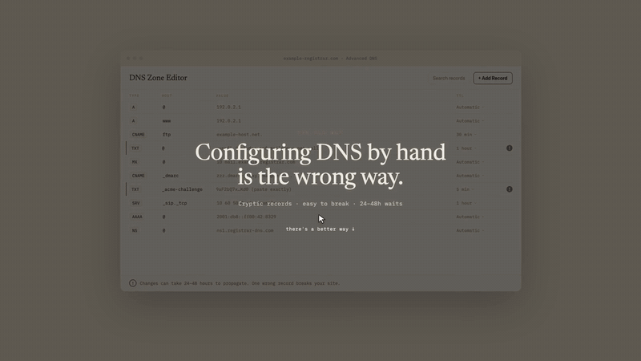

  <picture>
    <source media="(prefers-color-scheme: dark)"  srcset="assets/everjust-wordmark-white.png">
    <source media="(prefers-color-scheme: light)" srcset="assets/everjust-wordmark-ink.png">
    
  </picture>

  <strong>EVERJUST builds and operates the software a small company runs on —
  agents that answer your customers, the workspace the business lives in, and the
  domain, mail and portal layers underneath.</strong>

  <a href="https://customagents.io/?utm_source=github&utm_medium=profile">Custom Agents</a> ·
  <a href="https://customdomain.ai/?utm_source=github&utm_medium=profile">Custom Domain</a> ·
  <a href="https://everjust.app/?utm_source=github&utm_medium=profile">EVERJUST.APP</a> ·
  <a href="https://customportal.app/?utm_source=github&utm_medium=profile">CustomPortal</a> ·
  <a href="https://directory.everjust.app/?utm_source=github&utm_medium=profile">Everything else</a>

  
  
  
  

---

## Products

### Custom Agents — an AI teammate your customers can text

The agent gets its own email address, its own phone number and its own Slack profile.
People reach it the way they reach a person — email, SMS and iMessage, Slack, Instagram,
voice — and it keeps one thread per customer across all of them. It is not a chat bubble
on a website.

The differentiator is the safety model, not the model. Every untrusted write tool is
withheld in **every** autonomy mode; an internal audit found the voice path bypassing that
rule on a live number, and the fix was verified in production as **7 writes denied, 5 reads
allowed**. Admin actions abort the mutation if the audit write fails. Around **440 tests**
gate CI and every new code path ships behind a default-off flag.

**[customagents.io](https://customagents.io/?utm_source=github&utm_medium=profile)** ·
[live status](https://status.customagents.io) ·
[status source](https://github.com/ever-just/status)
`Node.js · MongoDB · Redis · Claude · Twilio/Sendblue · AWS`
closed source

### Custom Domain — your users bring a domain they already own

Detect their DNS provider, write the records, verify ownership, issue and renew TLS.
**63 DNS and registrar providers**, **25+ of them fully automatic**, typically **live with
HTTPS in about 30 seconds**. There is a REST API, an embeddable widget, an SDK, and a
hosted MCP server so an agent can search, buy and connect a domain end to end.

The part worth reading the code for is the checkout. An early version charged a real
customer $2.99 for a domain the registrar then failed to register. It was torn out and
rebuilt on Stripe manual capture: the card is authorised, the registrar is called, and the
capture only happens once registration is confirmed — otherwise the authorisation is
cancelled and the customer pays nothing. **The checkout cannot charge for a domain it did
not deliver.**

**[customdomain.ai](https://customdomain.ai/?utm_source=github&utm_medium=profile)** ·
[docs](https://docs.customdomain.ai/docs) ·
[trust center](https://trust.customdomain.ai) ·
[**all the code**](https://github.com/CUSTOM-DOMAIN-APP)
`TypeScript · Go · Next.js · Postgres · Caddy edge · Domain Connect · Stripe`

### EVERJUST.APP — one workspace, one flat licence, your own database

**34 apps across eight categories** on one shared customer record, under your own brand.
Every organisation gets its own PostgreSQL database at `<org>.everjust.app`; an nginx
wildcard certificate routes the subdomain to that database at the infrastructure layer,
so tenant isolation is a property of the topology rather than a column in a table.

Self-serve signup with embedded Stripe Checkout has been live since **2026-07-21**.
Deploys are change-aware: a control-plane-only change ships with **no tenant outage**.
Real businesses run on it today on their own apex domains, with certificates issued per
tenant.

**[everjust.app](https://everjust.app/?utm_source=github&utm_medium=profile)**
`Odoo 19 · FastAPI · PostgreSQL (one DB per tenant) · nginx · Stripe · AWS SES`
closed source

### CustomPortal — the client portal your firm runs under its own name

A white-label client portal: your clients sign in at your domain, see your brand, and
never learn our name. Same isolation rule as the platform above — a database per tenant,
no `tenant_id` anywhere, no runtime DDL, fail-closed client scoping.
**2,044 tests green** at v2 close, an enforcing Content-Security-Policy verified at zero
violations before it was enforced, and nightly `pg_dumpall` on a 14-day retention beside
daily snapshots.

**[customportal.app](https://customportal.app/?utm_source=github&utm_medium=profile)** ·
[see the client view](https://demo.customportal.app)
`TypeScript · Postgres (DB per tenant) · Lightsail`
closed source

### JustMail — self-hosted mail, contacts and chat

Carved out of the platform above and rebuilt as its own product: unified inbox with
reply-from-received-identity, server-side rules, a ⌘K palette, spam routing driven by the
SES verdict carried in an HMAC-bound header, and bounce/complaint handling wired to real
delivery state. **623 of 623 tests green.** The icon set is 52 hand-authored SVGs applied
as scoped CSS masks, deliberately layered over the original classes so an unmapped icon
degrades to "looks dated" and never to a tofu box.

`Odoo 19 CE · OWL · PostgreSQL · AWS SES`
closed source

## Where the code lives

Four accounts, four jobs. Nothing is hidden in the wrong one.

| Account | Its job | What is public there |
|---|---|---|
| [`ever-just`](https://github.com/ever-just) | This account. Company front door, plus tools you can clone and run yourself. | `agentskills`, `company-dossier`, `textmyagent-desktop`, `status` |
| [`EVERJUST-DEV`](https://github.com/EVERJUST-DEV) | The product org — the platform, Custom Agents, CustomPortal, JustMail. Mostly private. | `usesend-email` |
| [`CUSTOM-DOMAIN-APP`](https://github.com/CUSTOM-DOMAIN-APP) | The Custom Domain product: SDK, MCP server, docs, integration guides. | 10 repos, including everything a developer needs |
| [`NEXUS-UST`](https://github.com/NEXUS-UST) | Not us — a student AI club at the University of St. Thomas that we help run. | club site and workshop material |

## Things you can use today

| Project | What it does |
|---|---|
| [agentskills](https://github.com/ever-just/agentskills) | ~130 `SKILL.md` files that give any file-reading coding agent real procedure — research pipelines, deployment, UI audits, agent forensics. Several document their own anti-patterns: `oem-partner-verification` records that only 2 of 40 claimed partnerships survived verification in a real run. |
| [customdomain-mcp](https://github.com/CUSTOM-DOMAIN-APP/customdomain-mcp) | Hosted MCP server. Point a coding agent at it and it can search, register and connect domains, TLS included. |
| [customdomain-sdk](https://github.com/CUSTOM-DOMAIN-APP/customdomain-sdk) | Official JS/TS client. |
| [awesome-custom-domains](https://github.com/CUSTOM-DOMAIN-APP/awesome-custom-domains) | The curated map of the whole custom-domain space: managed services, DIY building blocks, protocols. |
| [usesend-email](https://github.com/EVERJUST-DEV/usesend-email) | Self-hosted multi-tenant transactional email on AWS SES, with Terraform and an MCP server. |
| [company-dossier](https://github.com/ever-just/company-dossier) | Opens a complete, sourced file on any company — people, money, hiring, tech, news, risk. Live at [companydossier.lol](https://companydossier.lol). |
| [company-dossier-vscode](https://github.com/ever-just/company-dossier-vscode) | The same thing inside your editor. |
| [textmyagent-desktop](https://github.com/ever-just/textmyagent-desktop) | macOS assistant that answers your iMessages on-device. No cloud, no API keys. |
| [discoverability](https://github.com/ever-just/discoverability) | A field guide to being found — [read it here](https://ever-just.github.io/discoverability/). |

<strong>Earlier work — kept for reference, not maintained</strong>

 

These are archived. They are readable, they are not supported, and several of the products
they describe are no longer online.

| Project | What it was |
|---|---|
| [flight-tracker](https://github.com/ever-just/flight-tracker) | Real-time US airport and flight status dashboard |
| [just-learn](https://github.com/ever-just/just-learn) | AI workshop management |
| [project-fosh](https://github.com/ever-just/project-fosh) | Chrome extension for local-only API key storage |
| [minnesotadirectory](https://github.com/ever-just/minnesotadirectory) | Minnesota company directory |
| [JUST-WORK](https://github.com/ever-just/JUST-WORK) | Mid-market Minnesota company search over 2,762 records |

## Community

We help run [NEXUS](https://ustnexus.club), the student AI club at the University of
St. Thomas — [workshop material](https://github.com/NEXUS-UST/build-workshop) is public —
and the [UST Management Consulting Club](https://management-consulting.club) site.
EVERJUST also produces **Twin Cities Startup Week**, running at
[tcstartupweek.com](https://tcstartupweek.com) on the platform above.

## Work with us

EVERJUST builds this kind of software for other companies too: AI agents that talk to real
customers, multi-tenant platforms, and the operations underneath them. If you have read
this far, you already know what we ship.

**company@everjust.co**

  
  <a href="https://customagents.io">Custom Agents</a> ·
  <a href="https://customdomain.ai">Custom Domain</a> ·
  <a href="https://everjust.app">EVERJUST.APP</a> ·
  <a href="https://customportal.app">CustomPortal</a> ·
  <a href="https://directory.everjust.app">The index</a>
  

